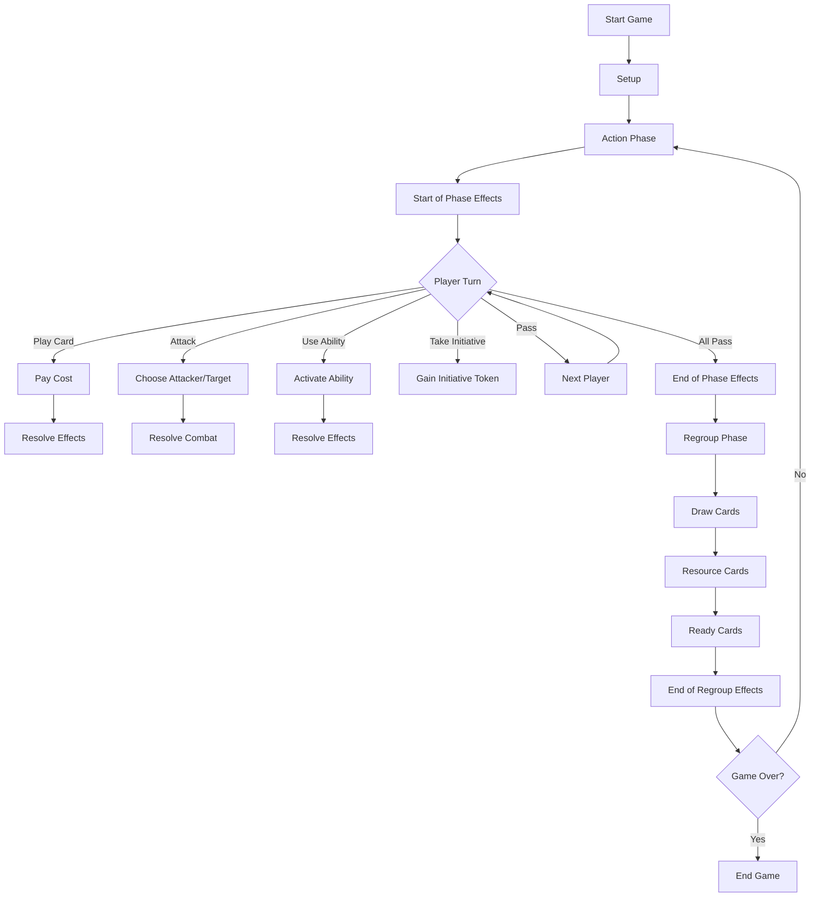

# Turn Structure in Star Wars Unlimited

Understanding the turn structure is crucial for mastering Star Wars Unlimited. This section provides a comprehensive overview of how each game round unfolds, from setup to victory. A solid grasp of turn structure will help you plan your strategies and make the most of each action.

## 1. Game Overview

A game of Star Wars Unlimited consists of multiple rounds, each divided into two main phases: the Action Phase and the Regroup Phase. Players alternate taking actions during the Action Phase and prepare for the next round during the Regroup Phase. The game continues until one player achieves victory by reducing their opponent's base to 0 HP or through other win conditions.

## 2. Starting the Game

Before the first round begins, players must set up the game:

1. Place bases into play
2. Put leaders into play
3. Determine the first player (usually by rolling a die or flipping a coin)
4. Shuffle decks and draw opening hands of 5 cards each
5. Choose whether to mulligan (redraw your entire hand once)
6. Resource two cards (place two cards face-down in your resource row)

For detailed setup instructions, see the [Setup and Victory](/docs/setup-and-victory/) section.

## 3. Round Structure

Each round in Star Wars Unlimited follows this structure:

### 3.1 Action Phase

The Action Phase is the core of the game, where players take turns performing actions. It consists of:

1. Start of phase step
   - Resolve any "at the start of the action phase" effects
   - This is when many ongoing effects trigger or refresh

2. Player turns
   - Players alternate taking one action at a time
   - Available actions: 
     - [Play a Card](/docs/player-actions/#2-play-a-card) (deploy units, use events, attach upgrades)
     - [Attack With a Unit](/docs/player-actions/#3-attack-with-a-unit) (engage enemy units or the opponent's base)
     - [Use an Action Ability](/docs/player-actions/#4-use-an-action-ability) (activate special abilities on cards)
     - Take the Initiative (gain control of the initiative token)
     - Pass (decline to take an action)

3. End of phase step
   - Resolve any "at the end of the action phase" effects
   - Check for any end-of-phase triggered abilities

{}
**Example:** During her turn in the Action Phase, Player A decides to play a unit card from her hand. She pays the resource cost by exhausting the required number of resource cards and places the unit in the appropriate arena. The unit's "When Played" ability triggers, if it has one. It's now Player B's turn to take an action.
{}

**Strategy Tip:** Carefully consider the order of your actions. Sometimes it's better to attack first before playing new units, while other times you may want to build up your forces before engaging the enemy.

### 3.2 Regroup Phase

The Regroup Phase prepares players for the next round. It consists of 5 steps:

1. Start of regroup phase
   - Resolve any "at the start of the regroup phase" effects
   - This is when many end-of-round abilities trigger

2. Draw cards
   - Each player draws 2 cards
   - If a player cannot draw due to an empty deck, they lose the game

3. Resource cards
   - Starting with the active player, each may put 1 card into play as a resource
   - This decision can be crucial for long-term strategy

4. Ready cards
   - Each player readies all their exhausted cards
   - This includes units, leaders, bases, and resources

5. End of regroup phase
   - Resolve any "at the end of the regroup phase" effects
   - Prepare for the next round's Action Phase

## 4. Turn Flow Diagram

Here's a detailed visual representation of the turn structure:

## 5. Ending the Game

The game ends when one of these conditions is met:

- A player's base reaches 0 HP
- A player has no cards in their deck and must draw a card
- A player concedes
- A card effect causes a player to win or lose the game

In the case of simultaneous win/loss conditions (e.g., both players' bases reach 0 HP at the same time), the game is a draw.

For more details on victory conditions, see the [Setup and Victory](/docs/setup-and-victory/) section.

## 6. Special Rules and Exceptions

- **Initiative Token:** The player with the initiative token can interrupt the normal turn order to take an action at any time. This can be a powerful tool for disrupting your opponent's plans.
- **Nested Actions:** Some card effects allow you to take additional actions outside the normal turn structure. These are resolved fully before returning to the main game flow.
- **Simultaneous Effects:** If multiple effects would trigger at the same time, the active player resolves their effects first, then the non-active player.

For more information on special rules and card interactions, see the [Abilities and Effects](/docs/abilities-and-effects/) section.

## 7. Frequently Asked Questions

**Q: Can I take multiple actions during my turn in the Action Phase?**
A: No, you can only take one action per turn. After your action, play passes to your opponent. However, some card effects may grant you additional actions.

**Q: What happens if I can't or don't want to take an action during the Action Phase?**
A: You can always choose to pass. If all players pass consecutively, the Action Phase ends.

**Q: Do I have to put a card into play as a resource during the Regroup Phase?**
A: No, this step is optional. You may choose not to play a resource if you don't want to or can't. However, building your resource base is crucial for playing more powerful cards later in the game.

**Q: Can I attack with a unit I just played this turn?**
A: Generally, no. Units have "summoning sickness" and cannot attack the turn they are played unless they have an ability that allows them to do so (like [Rush](/docs/keywords/#rush)).

**Q: What happens if I run out of cards in my hand?**
A: You can still take actions with cards in play, but you won't be able to play new cards until you draw more during the Regroup Phase or through card effects.

For more detailed information on specific actions and abilities, please refer to the [Player Actions](/docs/player-actions/) and [Abilities and Effects](/docs/abilities-and-effects/) sections.